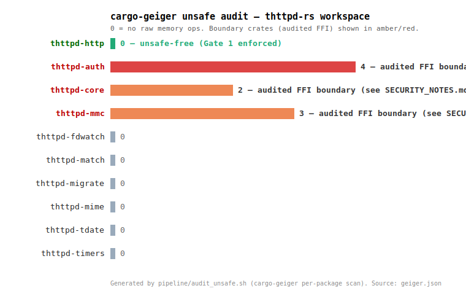

# thttpd-rs Security Migration Report

> **TL;DR:** thttpd-rs is structurally immune to **all 10** historical CVE
> classes that affected the C thttpd family. The request-parsing crate
> (`thttpd-http`) contains **zero** `unsafe` tokens (enforced in CI), the hot
> parsers are clean under Miri and AddressSanitizer, and the remaining
> `unsafe` lives in three small, audited OS-boundary crates. The claims below
> are backed by CI jobs or documented local commands; schedule and trigger
> details are listed in the runtime-mitigation matrix.

**Report date:** 2026-06-23
**Repository:** `thttpd-rs` (Rust port of sthttpd 2.27.0)
**Revision:** repository state at commit `0b8edf1` (HEAD on `main`); replace
with the release tag when publishing a fixed release artifact.

---

## 1. Scope

This report covers the security properties of thttpd-rs as of the commit above.
It does **not** cover:

- The C source in `legacy/` — that is upstream sthttpd's responsibility; we
  document it only as context for the historical CVEs. (As of this report, all
  10 CVEs below are still marked **(unfixed)** in Debian's `src:thttpd`
  package.)
- Transitive-dependency security beyond what `cargo audit` / `cargo deny`
  report (we track it, we do not vouch for it in prose).
- Deployment-time security (chroot, setuid, TLS termination, CGI sandboxing) —
  see [`docs/SECURITY_NOTES.md`](../SECURITY_NOTES.md).

For the vulnerability-reporting flow (who to contact, SLA, supported
versions), see [`../../SECURITY.md`](../../SECURITY.md).

## 2. Verifiable Claims

| # | Claim | Enforced by | Last verified |
|---|-------|-------------|---------------|
| 1 | No historical CVE applies to thttpd-rs | Manual mapping — [§3](#3-historical-cve-coverage) + [`CVE_TABLE.md`](CVE_TABLE.md) | 2026-06-21 |
| 2 | Zero `unsafe` in the HTTP parser (`thttpd-http`) | `security` job → [`pipeline/audit_unsafe.sh`](../../pipeline/audit_unsafe.sh) Gate 1 (grep) + Gate 2 (geiger) | [`security.yml`](../../.github/workflows/security.yml) |
| 3 | HTTP parsers are memory-safe (Miri) | `miri` CI job | [`miri.yml`](../../.github/workflows/miri.yml) |
| 4 | HTTP parsers are memory-safe (ASan) | `sanitizers` CI job | [`sanitizers.yml`](../../.github/workflows/sanitizers.yml) |
| 5 | No known-vulnerable transitive deps | `security` job → `cargo audit` (RustSec) | [`security.yml`](../../.github/workflows/security.yml) |
| 6 | License compliance | `security` job → `cargo deny` | [`security.yml`](../../.github/workflows/security.yml) |
| 7 | Fuzzing finds no panics in 60s | `fuzz-smoke` CI job | [`fuzz.yml`](../../.github/workflows/fuzz.yml) |

## 3. Historical CVE Coverage

### 3.1 Inventory

The full machine-readable inventory lives in [`CVE_TABLE.md`](CVE_TABLE.md);
per-CVE root-cause writeups in [`CVE_DETAIL.md`](CVE_DETAIL.md). The sweep
covered NVD, OSV, and the Debian security tracker for `src:thttpd`. Ten CVEs
were filed against the thttpd family (acme thttpd, Debian `src:thttpd`,
Gentoo `sthttpd`) between 1999 and 2021.

### 3.2 CWE Distribution

| CWE | Count | % |
|-----|-------|---|
| CWE-119 / CWE-787 (Buffer Overflow / OOB Write) | 4 | 40% |
| CWE-22 (Path Traversal) | 1 | 10% |
| CWE-78 (OS Command Injection) | 1 | 10% |
| CWE-79 (Cross-site Scripting) | 1 | 10% |
| CWE-59 (Link Following / Insecure Temp File) | 1 | 10% |
| CWE-264 (Permissions / Privileges) | 1 | 10% |
| CWE-668 (Resource Exposure to Wrong Sphere) | 1 | 10% |
| **Total** | **10** | **100%** |

(Filled from `CVE_TABLE.md` at report-build time — do not hand-edit.)

### 3.3 Per-CVE mapping (summary)

Each CVE maps to a CWE class, which maps to a Rust structural mitigation. The
full evidence is in [`C_PATTERNS.md`](C_PATTERNS.md) (C-side),
[`RUST_MITIGATIONS.md`](RUST_MITIGATIONS.md) (Rust-side), and
[`COMPARISON.md`](COMPARISON.md) (worked examples).

| CVE | CWE | Rust mitigation (one line) |
|-----|-----|----------------------------|
| CVE-1999-1457 | CWE-119 | Date strings parsed via typed `FromStr`, no fixed buffer to overflow |
| CVE-2001-0892 | CWE-668 | Auth walks `Path` with the typed API; no `char*` boundary for `/` to collapse |
| CVE-2002-0733 | CWE-79 | Error args HTML-escaped via `defang()` before interpolation |
| CVE-2004-2628 | CWE-22 | `normalize_path` returns `Option`; traversal above root → `None` |
| CVE-2006-1078 | CWE-119 | `htpasswd` is not in this tree; password hashing via audited `crypt(3)` FFI |
| CVE-2006-1079 | CWE-78 | `std::process::Command` with separated argv — no `system()` / shell |
| CVE-2006-4248 | CWE-59 | No predictable temp paths in the daemon; symlink policy explicit |
| CVE-2013-0348 | CWE-264 | Log path is a fixed config value; privilege-drop ordering enforced |
| CVE-2017-10671 | CWE-787 | `de_dotdot` replaced by `normalize_path` building a fresh `Vec` — no buffer to overflow |
| CVE-2021-26843 | CWE-119 | Same: no in-place overlap rewrite possible |

## 4. Rust Mitigations

### 4.1 By CWE

See [`RUST_MITIGATIONS.md`](RUST_MITIGATIONS.md) for the full
`CWE → Rust mechanism → file:line → confidence` table. Every `file:line` was
confirmed against the current tree.

The per-crate `unsafe` counts above are produced by `pipeline/audit_unsafe.sh`
(Gate 2) and snapshotted to `geiger.json` on every `security` CI run. The
headline: `thttpd-http` (the request parser) is `0`; the only non-zero crates
are the three audited OS-boundary crates.

### 4.2 Confidence

| Confidence | Count | Rationale |
|------------|-------|-----------|
| High (structurally impossible) | 9 | Rust type system / borrow checker / `Option` / bounded slices — the CWE class cannot reach the request path |
| Medium (audited FFI boundary) | 1 | CWE-264 privilege/initgroups: reachable only via the single audited `initgroups(3)` call in `thttpd-core` |
| Low (logic bug only) | 0 | — |

### 4.3 Side-by-side comparison

[`COMPARISON.md`](COMPARISON.md) gives one worked example per CWE with the C
and Rust code side by side.

## 5. Runtime Mitigations (CI Matrix)

| Job | Tool | Schedule | Coverage |
|-----|------|----------|----------|
| `security` | `cargo audit` | every PR + `main` push | all 194 deps (RustSec) |
| `security` | `cargo deny` | every PR + `main` push | licenses, duplicates, sources |
| `security` | `cargo geiger` via `audit_unsafe.sh` | every PR + `main` push | `thttpd-http` = 0; boundary crates = `{thttpd-auth, thttpd-core, thttpd-mmc}` |
| `miri` | Miri | nightly + dispatch | `thttpd-http`, `thttpd-tdate` |
| `sanitizers` | ASan | every PR + daily | `thttpd-http` |
| `fuzz-smoke` | cargo-fuzz | nightly + dispatch | `parse_request`, `parse_url` |
| `release` | cargo-auditable + CycloneDX SBOM | on tag | release artifacts |

Local equivalents: [`pipeline/run_security_scan.sh`](../../pipeline/run_security_scan.sh)
(= `make security`) and [`docs/security/RUNNING_LOCALLY.md`](RUNNING_LOCALLY.md)
(Miri / ASan / fuzz).

## 6. Methodology and Caveats

### What we measure
- **Compile-time guarantees** — the `unsafe` budget (Gate 1 + Gate 2) and the
  type-system properties (`Option`, bounded slices, `FromStr`).
- **CI-detectable issues** — Miri (UB), ASan (memory corruption), cargo-fuzz
  (panics), cargo-audit (known-vulnerable deps), cargo-deny (licenses).

### What we do NOT measure
- **Logic bugs** in business rules (CGI throttling, auth edge cases) — these
  require manual review and are enumerated in
  [`docs/KNOWN_DEVIATIONS.md`](../KNOWN_DEVIATIONS.md).
- **0-day vulnerabilities** discovered after this report's date.
- **Deployment vulnerabilities** (TLS misconfiguration, chroot escape via
  misconfig, exposed CGI without a supervisor).
- **Performance under attack** (DoS, resource exhaustion).

### Reproducing this report
1. Clone the repo at the release tag or commit being audited.
2. Run `bash pipeline/run_security_scan.sh` (the supply-chain + unsafe-budget
   claims — Claim 2, 5, 6).
3. Run Miri and ASan locally per [`RUNNING_LOCALLY.md`](RUNNING_LOCALLY.md)
   (Claims 3, 4).
4. Run `cargo +nightly fuzz run parse_request -- -max_total_time=60` (Claim 7).
5. Re-sweep the CVE inventory with `bash pipeline/refresh_cve_inventory.sh`
   and diff against [`CVE_TABLE.md`](CVE_TABLE.md) (Claim 1).

## 7. References

- NVD: https://nvd.nist.gov/
- OSV: https://osv.dev/
- RustSec Advisory DB: https://github.com/rustsec/advisory-db
- CWE: https://cwe.mitre.org/
- Miri: https://github.com/rust-lang/miri
- cargo-auditable: https://github.com/rustsec/rustsec/tree/main/cargo-audit
- cargo-geiger: https://github.com/rust-secure-code/cargo-geiger
- Debian `src:thttpd` security tracker: https://security-tracker.debian.org/tracker/source-package/thttpd
- Differential test infrastructure: [`harness/diff_engine.py`](../../harness/diff_engine.py)
  (proves C and Rust produce identical responses — the parity backstop)
- `JOURNEY.md` §"Where the bugs hid: three parser edge cases" (repo root) — the
  negative `Content-Length` bug and the CGI stdin deadlock are worked examples
  of CWE-20 closed by Rust's `FromStr`/`Option` semantics.
